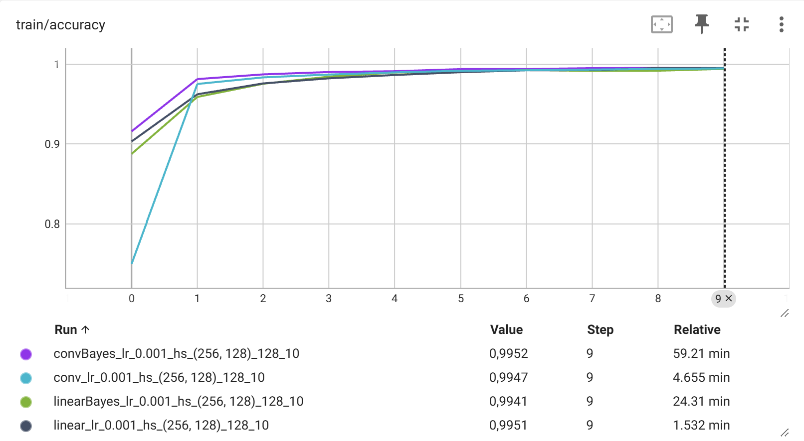
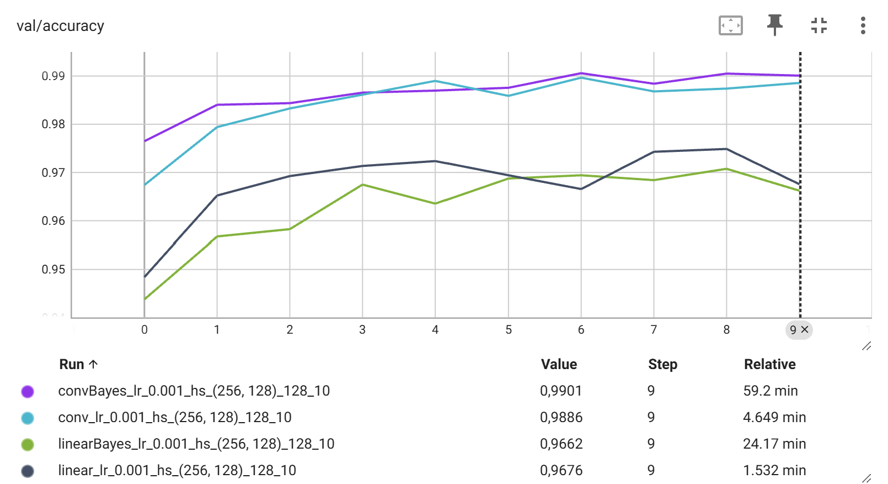

# Bayes By Backprop

## Description

Implementation of the Bayes by Backprop [paper](https://arxiv.org/abs/1505.05424). Implemented a Linear and Convolutional Bayesian Neural Network, defining the weights as Gaussian distributions as it is done in the paper. These techniques are compared with the torch versions using MNIST dataset for classification.

## Results

### Training and Validation Results

_Training accuracy comparison between Deterministic and Bayesian Neural Networks over multiple epochs. The Bayesian approach shows comparable learning patterns to traditional networks._

_Validation accuracy results demonstrating how both models perform on unseen data. The plots highlight the generalization capabilities of each approach across training iterations._

### Accuracy Results

| Model Type  | Training Accuracy | Validation Accuracy | Test Accuracy |
| ----------- | ----------------- | ------------------- | ------------- |
| Linear      | 99.51%            | 96.76%              | 96.93%        |
| LinearBayes | 99.41%            | 96.62%              | 97.07%        |
| Conv        | 99.47%            | 98.86%              | 99.09%        |
| ConvBayes   | 99.52%            | 99.01%              | 99.20%        |

The test results show that Bayesian Neural Networks achieve comparable or slightly better performance compared to their deterministic counterparts, particularly in the convolutional architecture.
